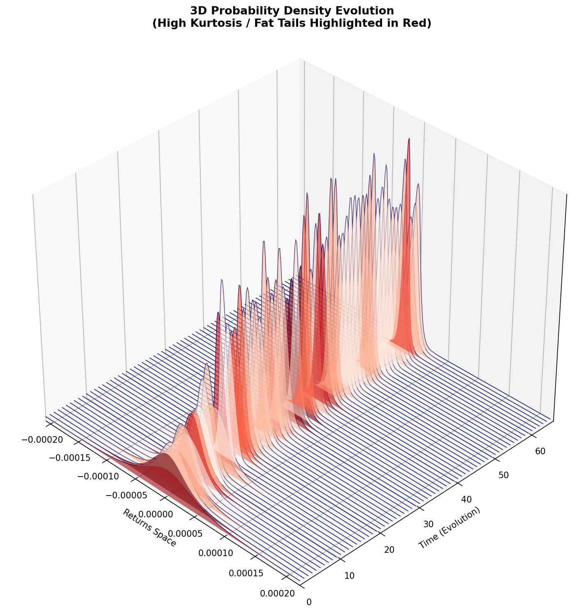
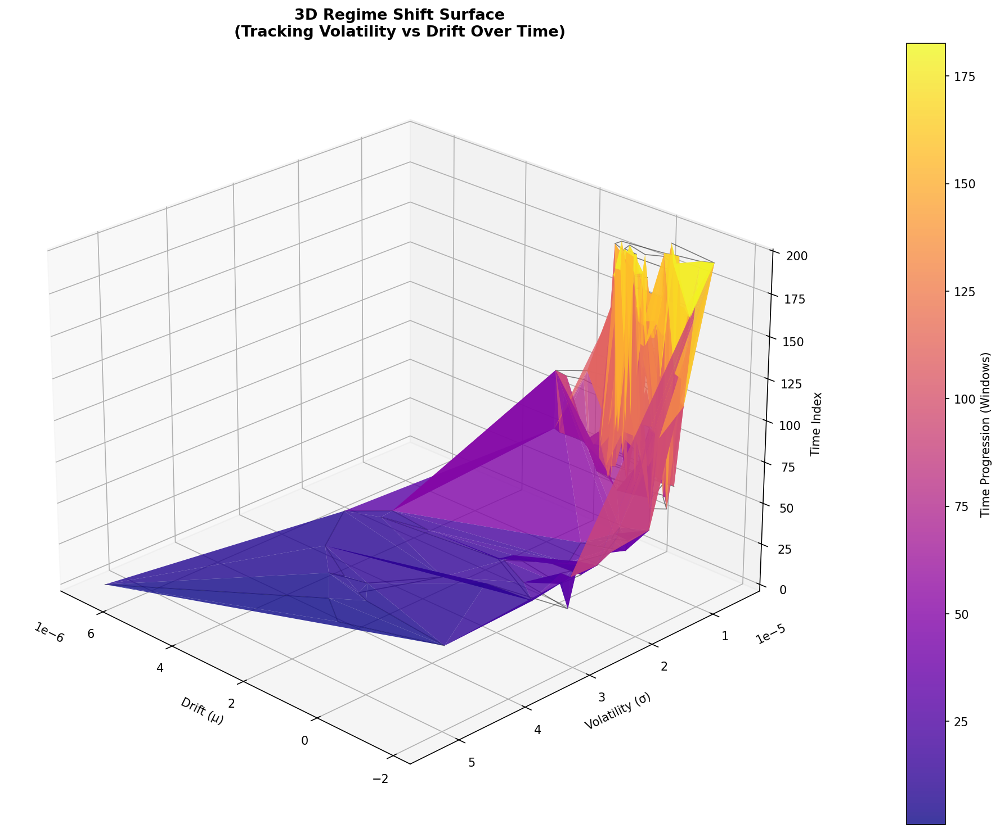

# Microstructure Alpha

[](https://github.com/CodeBYMehdi/microstructure-alpha/actions)
[](https://www.python.org/downloads/)
[](LICENSE)

A tick-by-tick mean-reversion trading system built on market microstructure analysis, regime detection, and adaptive risk management. Designed for institutional-grade backtesting and live execution via Interactive Brokers.

---

## System Architecture

```
Raw Ticks ──> Microstructure Engine ──> Regime Detection ──> Decision Engine ──> Execution
                  │                         │                      │                 │
            GMM Density               HDBSCAN Clustering     Kelly Sizing      IB / Simulator
            GARCH Vol                 KL-Divergence           Adaptive Exits    Rate Limiting
            Order Flow                Transition Detector     Signal Combiner   Slippage Model
            Entropy / Tails           Regime Labeling         Confidence Score  Impact Model
```

### Data Flow

| Stage | Module | Output |
|-------|--------|--------|
| **Ingestion** | `data/tick_stream.py`, `data/l2_orderbook.py` | Validated ticks, L2 snapshots |
| **Feature Extraction** | `microstructure/pdf/`, `microstructure/moments.py`, `microstructure/entropy.py` | GMM density, moments (mu, sigma, skew, kurtosis), tail risk, entropy |
| **State Construction** | `regime/state_vector.py` | 6-dimensional state vector |
| **Regime Classification** | `regime/clustering.py`, `regime/transition.py` | Regime labels (Bull/Bear/Sideways), transition events |
| **Signal Generation** | `alpha/feature_engine.py`, `alpha/return_predictor.py`, `alpha/signal_combiner.py` | Blended alpha signal (regime + online SGD predictor) |
| **Decision** | `decision/entry_conditions.py`, `decision/sizing.py`, `decision/adaptive_exits.py` | Trade proposals with Kelly-sized positions |
| **Risk** | `risk/kill_switch.py`, `risk/exposure.py`, `risk/tail_risk.py` | Position limits, drawdown guards, emergency flatten |
| **Execution** | `execution/order_router.py`, `execution/ibkr_router.py` | Rate-limited order submission, fill tracking |

---

## Visualizations

### Probability Density Evolution

Tracks the real-time evolution of the return distribution estimated via Gaussian Mixture Models. Red surfaces highlight periods of elevated kurtosis (fat tails), signaling increased tail risk and potential regime transitions.

<p align="center">
  
</p>

### Volatility-Drift Regime Surface

Maps the joint dynamics of drift (mu) and volatility (sigma) over time. The color gradient represents temporal progression -- purple (early) to yellow (late) -- revealing how the volatility-drift relationship evolves across regime shifts.

<p align="center">
  
</p>

---

## Core Components

### Microstructure Engine

- **GMM Density Estimation** -- non-parametric PDF of tick returns via Gaussian mixtures
- **GARCH Conditional Volatility** -- time-varying sigma fed into the moments calculator
- **Order Flow Imbalance** -- L2 book slope, liquidity pull scores, bid-ask dynamics
- **Entropy & Tail Risk** -- information density and extreme-event probability metrics
- **VPIN / Kyle's Lambda / Amihud** -- toxicity, price impact, and illiquidity estimators

### Regime Detection

- **HDBSCAN Clustering** -- density-based regime identification with adaptive `min_cluster_size`
- **KL-Divergence Transitions** -- statistical detection of distribution shifts between windows
- **PCA Projection** -- dimensionality-reduced transition strength via weighted delta vectors
- **Bootstrap Signal Path** -- synthesizes transition events from mu-velocity when no regime change is detected but signal is strong

### Decision Engine

Pipeline: `TradeEligibility` -> `EntryConditions` -> `ConfidenceScorer` -> `PositionSizer` -> `AdaptiveExitEngine`

- **Mean-reversion signal**: positive velocity/acceleration -> SELL, negative -> BUY
- **Kelly Criterion sizing** with liquidity adjustment and impact-aware capping `[0.1, 2.0]`
- **Adaptive exits**: dynamic stop-loss, take-profit, and trailing stops calibrated to regime volatility

### Risk Management

- **Kill Switch** -- global emergency flatten on drawdown, latency, or error-rate breach; wired into `on_tick()` and `_execute_trade()`
- **Exposure Tracker** -- real-time position and notional exposure monitoring
- **Tail Risk Model** -- EVT-based tail probability estimation
- **Confidence Warmup** -- scaled to `min_cluster_size * 3` to prevent false triggers during startup

### Execution

- **Rate Limiting** -- 10 orders/sec, 100 orders/min hard caps
- **Slippage & Impact Models** -- integrated into cost estimation before order submission
- **Order State Tracking** -- SUBMITTED -> FILLED/CANCELLED lifecycle with reconciliation
- **Trade Ledger** -- append-only CSV audit trail with crash recovery
- **IB Auto-Reconnect** -- exponential backoff on connection loss

---

## Optimization & Validation

- **Walk-Forward Optimization** -- rolling train/test splits with Bayesian optimization (scikit-optimize)
- **Out-of-Sample Validation** -- deflated Sharpe ratio with multiple-testing correction
- **Sensitivity Analysis** -- parameter perturbation to identify fragile configurations
- **Stationarity Tests** -- ADF and KPSS for return series validation

---

## Getting Started

### Prerequisites

- Python 3.11, 3.12, or 3.13
- Rust toolchain (for core acceleration module)

### Installation

```bash
git clone https://github.com/CodeBYMehdi/microstructure-alpha.git
cd microstructure-alpha
pip install -r requirements.txt
```

Build the Rust acceleration layer:

```bash
cd rust && cargo build --release && cd ..
```

### Configuration

Three YAML files in `config/` control the system, validated by Pydantic schemas:

| File | Purpose |
|------|---------|
| `execution.yaml` | Mode (`simulation` / `replay` / `live`), data source, router settings |
| `instruments.yaml` | Symbol, exchange, tick size, lot size |
| `thresholds.yaml` | All numerical thresholds: regime, risk, PDF, decision, sizing, exits |

---

## Usage

```bash
# Run strategy on synthetic data
python main.py

# Event-driven backtest
python scripts/run_massive_backtest.py

# Monte Carlo stress test
python run_massive_headless.py

# Walk-forward optimization
python scripts/run_optimize.py

# Live trading (requires TWS/Gateway)
python main.py --mode live

# Run test suite
python -m pytest tests/ -v --tb=short
```

---

## Repository Structure

```
microstructure-alpha/
├── alpha/              # Feature engineering, return prediction, signal blending
├── analytics/          # Post-trade attribution & tearsheet generation
├── backtest/           # Event-driven simulation engine (priority queue)
├── config/             # YAML configs & Pydantic validation schemas
├── core/               # Abstract interfaces (5 ABCs) & shared type definitions
├── data/               # Tick streams, L2 orderbook, HDF5 storage, IB client
├── decision/           # Entry conditions, exits, sizing, eligibility, confidence
├── execution/          # Order routing, slippage/impact models, trade ledger, IB router
├── infrastructure/     # Checkpoint management, system utilities
├── microstructure/     # GMM density, moments, entropy, return calculations
├── monitoring/         # Alerts, model health, regime drift, watchdog daemon
├── optimization/       # Walk-forward optimizer, OOS validation, sensitivity analysis
├── regime/             # HDBSCAN clustering, transition detection, state vectors
├── risk/               # Kill switch, exposure tracking, tail risk, stress tests
├── rust/               # Rust-accelerated core computations
├── scripts/            # Backtest runners, data tools, visualization scripts
├── statistics/         # Deflated Sharpe, stationarity tests, cost analysis
└── tests/              # Unit and integration test suite
```

---

## Disclaimer

This software is provided for educational and research purposes only. Trading financial instruments carries substantial risk of loss. The author assumes no liability for financial losses resulting from the use of this system.
